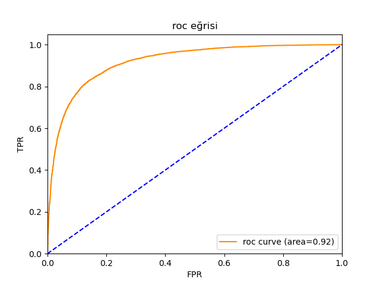

## ** IMDB RNN Sentiment Analysis**

Bu proje, IMDB film yorumlarının olumlu (1) veya olumsuz (0) olarak sınıflandırılması için bir RNN tabanlı duygu analizi modeli oluşturur. Model, Keras IMDB datasetini kullanır ve Embedding → SimpleRNN → Dropout → Dense mimarisine sahiptir.

Ayrıca Keras Tuner ile hiperparametre optimizasyonu yapılmıştır (embedding boyutu, RNN birim sayısı, dropout oranı, optimizer seçimi vb.).

 ## **Özellikler**

IMDB veri seti (50.000 yorum)

Tokenizasyon + Padding

Embedding katmanı

SimpleRNN yapısı

Dropout ile overfitting azaltma

Hiperparametre araması (Keras Tuner – RandomSearch)

EarlyStopping

Accuracy, AUC ve loss sonuçları

ROC eğrisi

Classification Report (precision, recall, f1-score)

Eğitilmiş modelin kaydedilmesi (isteğe bağlı)

## **Model Mimarisi**
Embedding → SimpleRNN → Dropout → Dense(1, sigmoid)

## **Hiperparametrelerle optimize edilenler:**

embedding_output: 32 – 128

rnn_units: 32 – 128

dropout_rate: 0.2 – 0.5

optimizer: adam / rmsprop

## ** Veri Ön İşleme**

IMDB dataset 0–9999 ID aralığındaki en sık kullanılan 10.000 kelime alınmıştır.

Yorum uzunlukları maxlen = 100 olacak şekilde pad_sequences ile eşitlenmiştir.

## ** Eğitim**

Model, Keras Tuner ile gerçekleştirilir.

## **Değerlendirme**

Test accuracy

Test AUC

classification_report (precision, recall, f1-score)

## **ROC eğrisi**

Aşağıda modelin ROC eğrisi gösterilmektedir:

Kod ROC eğrisini otomatik çizer.

## ** Gerekli Kütüphaneler**
tensorflow
numpy
matplotlib
scikit-learn
keras-tuner

